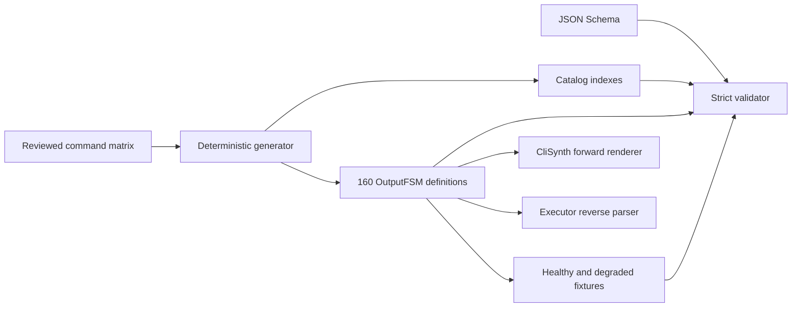

# Architecture

## Purpose and boundary

This repository is the declarative command contract for OpenNV. An OutputFSM
definition maps structured, synthetic inventory fields into vendor-shaped CLI
text and exposes the corresponding normalized result schema. It does not
connect to devices, parse arbitrary native output on its own, schedule work, or
store run evidence.

The repository is independently versioned. CliSynth consumes definitions in
the forward direction to render synthetic text; the OpenNV Nornir executor
consumes the same reviewed grammar in reverse to admit commands and normalize
real command results. Those engines remain separate projects.

## Source-of-truth flow

`scripts/generate.py` contains the reviewed matrix and is the source of truth
for the initial catalog. Generated YAML is committed so consumers can pin and
audit exact bytes without running code. A change is complete only when
regeneration is clean and the validator and tests pass.

## Definition contract

Every command has:

- one canonical platform and command identity plus unambiguous aliases;
- a literal template with explicitly declared variables;
- only inventory paths, literals, and allow-listed pure generators;
- a normalized result schema;
- deterministic healthy and degraded synthetic inventory, output, and result
  fixtures; and
- a catalog validation hint used to build the companion policy pack.

Definitions cannot execute Python, shell, regular expressions supplied by the
pack, arbitrary template expressions, or host I/O. Engines impose file, output,
field, and batch limits in addition to schema validation.

## Compatibility

The `apiVersion` controls document shape. A compatible alpha change may add an
optional field; a change that alters existing semantics, normalized paths, or
generator behavior requires coordinated consumer changes and an explicit API
version decision.

The companion `validation-packs` repository pins a catalog snapshot. Changes to
command IDs or normalized result paths must update that snapshot and execute
the cross-repository integration check before release.

## Content and trademark boundary

Fixtures are original synthetic test material. They use documentation-safe
identifiers and recognizable structural conventions but are not vendor captures
or a certification of byte-for-byte compatibility with a particular software
release, parser library, or device. Vendor names and marks identify
interoperability targets and remain the property of their owners.
